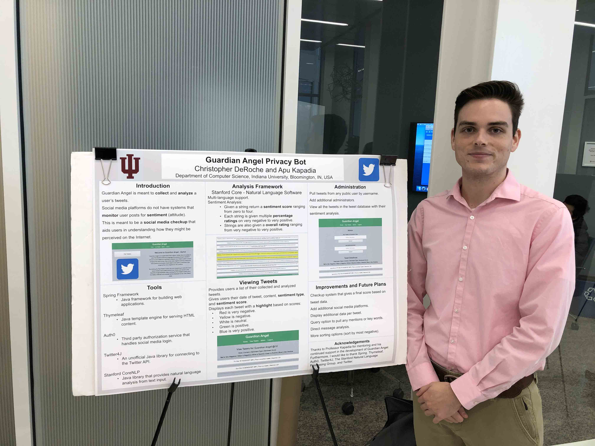

### Hi there, I'm Christopher DeRoche 👋
I am a senior in Computer Science at Indiana University-Bloomington graduating in May 2021 who is passionate about programming. All of my personal projects can be found here on GitHub. I am currently looking for full-time software engineering roles.

#### [My Resume](http://cdero.com/resume.html)

#### Get in touch
- Twitter: https://twitter.com/dr_deroche
- Personal Site: http://cdero.com/

<!--
**compact-disc/compact-disc** is a ✨ _special_ ✨ repository because its `README.md` (this file) appears on your GitHub profile.

Here are some ideas to get you started:

- 🔭 I’m currently working on ...
- 🌱 I’m currently learning ...
- 👯 I’m looking to collaborate on ...
- 🤔 I’m looking for help with ...
- 💬 Ask me about ...
- 📫 How to reach me: ...
- 😄 Pronouns: ...
- ⚡ Fun fact: ...
-->
